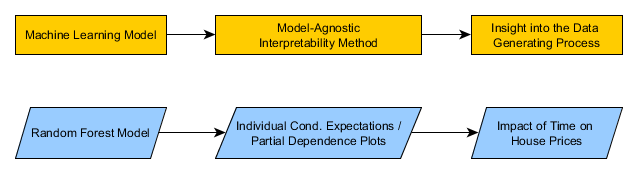

```{r setup, include=FALSE}
  knitr::opts_chunk$set(echo = TRUE, collapse=TRUE, messages=FALSE, eval=TRUE)
```

```{r quiet_package_load, echo=FALSE}

  suppressMessages(suppressWarnings(library(hpiR)))
  suppressMessages(suppressWarnings(library(knitr)))
  suppressMessages(suppressWarnings(library(tidyverse)))
  
```

### Abstract

Real estate price indexes are widely used across a variety of use cases, research designs and property types. The approaches to index generation are almost exclusively found in the realm of traditional statistics: ranging from simple median calculation to complex multiple regression formats. This paper presents a machine learning approach -- applying model-agnostic interpretability methods to a random forest -- to derived home price indexes.  Additionally, I present a framework (and associated software package, `hpiR`) for evaluating and comparing the quality of house price indexes.

## Introduction

Traditionally, house price indexes have been generated through highly interpretable (statistical) modeling approaches such as multiple regression models.  Standard statistical models are a good fit for this task as the coefficient estimates are easily convertable into standardized indexes. In short, house price index generation is not viewed as a prediction problem (engineering), but rather a scientific endeavor in which the attribution of the effects on time on market movements is sought.  As a result, many of the rapidly growing set of machine learning algorithms -- support vector machines, random forests and neural networks -- have not been used in the production of price indexes due to the fact that the do not directly (easily) attribute impacts to the variables or features in the model. With the rise of interpretability methods, these 'black-box' models can be made more explainable and suitable for a more diverse set of tasks. 

This paper highlights the use of two related model-agnostic interpretability methods (Molnar 2019) -- individual conditional expections and partial dependency plots -- to generate house price indexes.  While any underlying model could be used (the beauty of model-agnostic approach), I show the process on a random forest model: one of the more common and intuitive machine learning models. Along with an explanation of the method and examples, the results from this application of model-agnostic interpretability methods are compared to the more traditional repeat sales and hedonic price model approaches. 

Data used in the examples and the comparisons are from the `hpiR` open source R package. In the comparative analyses I provide extra details on the functionality and lexicon of the `hpiR` package to assist in the reproducibility of this work.

The remainder of this work is organized as follows:  Section two provides a brief overview on the main themes in house price index research. Next, I discuss the interpretable random forest approach and provide details using the `hpiR` dataset: Seattle, WA homes sales in the 2010 through 2016 period. In section four, the random forest method is compared to more traditional models across a number of metrics -- volatility, revision and accuracy. Finally, I conclude with a discussion and suggestions for future work. All data and code to reproduce this analysis (as well as download and use the entire `hpiR` package) can be found at: [www.github.com/andykrause/hpiR/papers/ares2019](https://www.github.com/andykrause/hpiR/papers/ares2019).

## Previous Work

Since the seminal Bailey et al. (1963) study there has been considerable and sustained research effort put into comparing and improving competing methods for generating house price indexes.  Published work in this subfield of housing economics is generally focused on one or more of four aims: 1) Comparison of model performance; 2) Identification and correction of estimation issues or problems; 3) Creation of local or submarket indexes; and 4) Development of a new model or estimator.

Studies comparing various indexing method were popular in the 1980s and 1990s (Mark & Goldberg 1984; Case et al 1991; Clapp et al 1991; Crone & Voith 1992; Gatzlaff & Ling 1994; Meese & Wallace 1997).  In most cases, work published during this period compared indexes generated with some permutation of repeat sale, hedonic, median/mean, assessed/appraised value and/or hybrid methods.  The results suggest little agreement in terms of the preferred method, though the median/mean based methods used in industry are generally shown to be less reliable (Mark & Goldberg 1984; Crone & Voith 1992; Meese & Wallace 1997). Clapp et al (1991) suggest that the hedonic method may outperform repeat sales models in short time periods, while a more recent study by Nagaraja et al (2014) show better results from a hybrid, autoregressive model (expanding on Case & Quigley (1991)) than from more traditional repeat sales models. Dorsey et al (2010) show substantively different results between hedonic and repeat sales models in identifying the peak of the market during the housing boom of the mid-2000s. Common across all studies, but most explicitly made by Case et al (1991), are discussions of the various shortcomings and issues that plague each model type.

Out of this arose a suite of research that set out to catalog, measure and, often, correct for the issues identified in the earliest comparative work.  The most commonly addressed issue is that of sample selection bias (Abraham & Schauman 1991; Haurin & Henderschott 1991; Clapp et al 1992; Case et al 1997;  Steele & Goy 1997; Gatzlaff & Haurin 1997, 1998; Munneke & Slade 2000), an issue affecting nearly all of the available models.  Issues stemming from the necessity to revise indexes over time, especially in the case of repeat sales models, have received attention in the literature (Clapp & Giacotto 1999; Butler et al 2005; Clapham et al 2006; Deng & Quigley 2008). Property age and depreciation and the biases associated with it have also been raised and methods presented to control for it have been offered (Goodman & Thibodeau 1997; Cannaday et al 2005; Chau et al 2005). Adding to the list of biases are potential problems arising from seller reservation bias (Goetzmann & Peng 2006) and submarket (or product) aggregation bias (Guttery and Sirmans 1998).

A related set of work tackles issues stemming from the treatment of time in the various price indexing models.  In short, the aggregation of time periods required to keep per period sample sizes high enough may create biased results (Englund et al 1999; Dreiman & Pennington-Cross 2004). As may the assumption in standard hedonic approach of time-consistent coefficients for the non-temporal independent variables (Knight et al. 1995, Zabel 1999).  To combat violations of the temporally stability in coefficient estimates a number of time-varying parameters approaches have been proposed (Knight et al 1995; Zabel 1999; Munneke & Slade 2001, Clapham et al. 2006).  Alternative time parametizations have, likewise, been presented to provide alternatives to excessive temporal aggregation (Schwann 1998; McMillen & Dombrow 2001).

Studies addressing spatial dependence in the models represent a final set of issues that have been raised (Can & Megbolugbe 1997; Gelfand et al 2004; Tu et al 2004; Nappi-Choulet & Maury 2009; Dorsey et al 2010).  The primary goal here is to improve the model estimates, and therefore, the index values by better accounting for the inherent spatial structure of housing markets.

A third category of research aims are those dealing with indexes for submarkets.  In this context submarkets can be strictly geographic (Goodman 1978; Hill et al 1997; Gunterman et al 2016) or non-spatial in nature, based on price quantiles or housing product -- 2 bedroom vs 3 bedroom, for example. (Pollakowski et al 1991; Guttery & Sirmans 1998; McMillen & Thorsnes 2006; Coulson & McMillen 2007; Jansen et al 2008; Prasad & Richards 2009).  The most straightforward approach to dealing with submarkets involves simply segmenting the data by submarket definition (geographic or otherwise) and using an established method to generate an index.  More complex methods have been proposed as well.  These primarily include the use of weighting observations to better match the submarket for which the index is being generated (Meese & Wallace 1991; Goetzmann & Spiegel 1997; McMillen 2003; Clapp 2004; Jansen et al 2008).  Spatially weighted approaches like the semi-parameteric method proposed by Clapp (2004) allow for a 'surface' of price indexes to be created that vary continuously over space.

The final set of studies present novel improvements to existing data generation, models or estimators. The first and most common are those presenting hybrid hedonic and repeat sales models aimed at capturing the benefits and negating the shortcomings of both individual model types (Case & Quigley 1991; Quigley 1995; Hill et al 1997; Englund et al. 1998, Nagaraja et al 2014; Guntermann et al 2016).  A number of more recent improvements have been offered to create pseudo-repeat sales (McMillen 2012; Guo et al 2014), estimate robust statistical models (Bourassa et al 2013; Bourassa et al 2016), produced chained indexes (Clapham et al 2006) and address small samples sizes with a frequency conversion method (Bokhari & Geltner 2012; Bourassa & Hoesli 2016).

The existing literature on house price index creation is broad and ventures into most directions taken by standard, inferential statistics.  What is lacking are attempts to leverage the growing body of machine learning models and techniques to understand real estate price movements over time.  This study presents a first attempt at doing so along with a software package to aid other in doing so as well. 

## A Machine Learning Approach

The term 'machine learning' often conjures the pejorative term 'black box'.  Or in other words, a model for which predictions are given but for reasons unknown and, perhaps, unknowable, by humans.  For use cases where a predicted outcome or response, be it a classfication or a regression problem, this may be enough.  In others, where model biases need to be diagnosed and/or individual feature contributions are a key concern of the research or model application (such as constructing house price indexes), machine learning models often need to be extended with interpretabilty methods.  

As the use of machine learning models has grown, so too have methods to help raise the interpretability of these approaches. Interpretability methods can be broken down across a number of dimensions (Molnar 2019):

1) Model-based vs. example-base explanations: Does the interpretability method provide enhanced human reasoning by explaining some feature(s) of the model or by providing additional insight into example observations from the data?

2) Model-specific vs. model agnostic: Is the interpretability method custom-built for a particular type of machine learning model or can it be applied to any model type?

3) Global vs. local surrogates: Does the interpretability method create a replacement or simplified version of the 'black box' for the entire model or just a local region? Local interpretable model-agnostic explanations (LIME) are a common type of local surrogate (Ribiero et al. 2016).

In this paper, I'll examien a model-based and model-agnostic approach that does not use a surrogate of either type.  

### Interpretable Random Forests

Random forests are a common modeling approach in the machine learning literature and across industry.  The random forest approach uses a large number of tree-based predictions, based on randomized subsets of the data for each tree and of the features (variables) at each split (Breiman 2001). Predictions are the mean (regression) or mode (classification) across all trees.  As such, random forests can be seen as a subsetting algorithm.  

Although random forests and other tree-based approaches are a standard tool in machine learning they have been little used in academic real estate studies and not at all in house price index creation. Much of the reason for this dearth is that random forests are somewhat of a black box in that they do not directly create coefficient estimates as more traditional statistical models do and, therefore, do not offer a direct approach to create price indexes. In short, they are not inherently interpretable. 

In the context of house price indexes, we are concerned with extracting from our model the specific impact that each time period has, conditionally, on the response or dependent variable.  For common modeled approaches such as a repeat sales or hedonic priceing model, the multiple regression coefficients serve as these conditional effects.  For a machine learning model, such as a random forest, coefficient-type values are not inherently generated by the model.  Here is where a model-agnostic interpretablility method can help.

&nbsp;



&nbsp;

Partial dependence plots, and the individual conditional expectations that drive them, can be used to extract the marginal impact of each time period, conditionally, on the reponse or dependent variable: house prices in this case. The resulting shape -- linear, monotonic, sinusonoidal, spline-like, etc. -- is entirely depending on the underlying model being evaluated. 

Conceptually, an individual conditional expectation (ICE) plot takes a single observations, X_i, and for one of the features or variables, Xs, simulates the predicted value of that observation under the hypothetical condition that this observation has each individual unique value of Xs in the entire dataset. As such, an ICE shows the marginal effect on the predicted outcome from a single feature (Friedman 2001).  Calculating ICEs for all data in the training set and averaging the marginal effects creates a partial dependence plot.  

### An Intepretable Example 

The `hpiR` package provides two sample datasets to work with. The first (`seattle_sales`,) includes over 43,000 sales of single family homes and townhouses within the City of Seattle over the 2010 to 2016 time frame. The second (`ex_sales`) is a subset of the first, encompassing only the central area of the city.  This more limited set of data contains about 5,300 transactions over the same time period.  The source of the data is the King County Assessor's office.^[ A small amount of data cleaning has gone into the creating the data, for more information on this process please contact the author.] The data is open and free to share. The examples below use the larger of the two to show how interpretability method can be used to convert predictions from a machine learning model into a house price index. 

<!-- The data can be loaded with the `data(seattle_sales)` and `data(ex_sales)` commands. We will work with the `ex_sales` object in this vignette. -->

<!-- ```{r load_data, echo = FALSE} -->
<!--   data(seattle_sales) -->

<!--   data(ex_sales) -->

<!-- ``` -->

The data includes the following information for all transactions:

| Field Name | Type | Example | Description |
| :----- | :-----: | :-----: | :------------------------- |
| pinx   | chr  | ..0007600046  | Tax assessor parcel identification number |
| sale_id  | chr | 2011..2621   | Unique sale identifier   |
| sale_price  | integer  | 308900   | Sale price  |
| sale_date  | Date   | 2011-02-22   | Date of sale   |
| use_type  | factor  | sfr   | Structure type   |
| area  | factor  | 15   | Tax assessor defined neighborhood or area   |
| lot_sf  | integer  | 5160   | Size of lot in square feet  |
| wfnt  | binary   | 1  | Is the property waterfront?  |
| bldg_grade  | integer  | 8 | Structure building quality  |
| tot_sf  | integer  | 2200   | Total finished square feet of the home |
| beds  | integer  | 3   | Number of bedrooms |
| baths  | numeric   |  2.5 | Numbrer of bathrooms   |
| age  | integer   | 100 | Age of home   |
| eff_age  | integer   | 12   | Years since major renovation   |
| longitude  | numeric   | -122.30254   | Longitude  |
| latitude  | numeric   | 47.60391  | Latitude  |

We begin by select the first observation in our sales data and creating an individual conditional expectations (ICE) plot for this observation over the entire 84 month time period of our data. To do so, we assume that this home sold 84 times, once each period, and then estimate the predicted value from the random forest across these 83 hypothetical sales (and one true sale).  Plotting these predicted values create the time series seen in Figure 1 below.

```{r, echo = FALSE}
  readRDS('c:/code/research/hpir/papers/ares_2019/ex1plot.rds')

```

This single ICE shows an interesting trend: too smooth during some periods and likely too volatile during others. If we now calculate the same ICE's for four more observations following the same steps above we see that our initial example was somewhat more erratically behaved than others and that, overall, all five examples in Figure 2 appear to show a similar trend of price movements -- moderate gains from 2010 to early 2013 followed by solid gain through the end of the time period.  

```{r, echo = FALSE}
  readRDS('c:/code/research/hpir/papers/ares_2019/ex15plot.rds') 
     
  

```

Expanding this exercise to all observations in the dataset and then averaging all points at each time period will create a partial dependency plot. Figure 3 averages only the five examples above as an exercise to show how quickly this blending or ensembling of individual conditional expectations can get to a relatively smooth estimate of price movements over time. This is not to say that one shouldn't calculat the full partial dependence plot, but rather than the PDP reaches it central tendency relatively quickly. 

```{r, echo = FALSE}
   readRDS('c:/code/research/hpir/papers/ares_2019/ex15aplot.rds')
```

The above plot show raw prices, not a true house price index.  To convert the above to an index we can simple divide the individual period values by the base value and multiply by 100, creating the index in Figure 4. Shown are both the index from the five examples above (thin black line) as well as one from the full sample (thick red line)

```{r, echo = FALSE}
   readRDS('c:/code/research/hpir/papers/ares_2019/ind15plot.rds')
```

## Comparison to Traditional Methods

To compare the quality of the random forest derived house price indexes I will use the `hpiR` package and its various comparative functionalities.  Before showing the comparison, it is worth a detour to discuss the lexicon around the judging the quality of indexes and how `hpiR` accomplishes this.^[More information on this package's development can be found at [www.github.com/andykrause/hpiR](https://www.github.com/andykrause/hpiR).] ^[The official CRAN repository page is located at: 
[https://cran.r-project.org/web/packages/hpiR/index.html](https://cran.r-project.org/web/packages/hpiR/index.html)] ^[A detailed explanation of the class and method structure employed in this package can be found in the **Classes in hpiR** vignette in this package, or at: [https://cran.r-project.org/web/packages/hpiR/vignettes/classstructure.html](https://cran.r-project.org/web/packages/hpiR/vignettes/classstructure.html)] 

### Package Basics

The `hpiR` package is written for the R statistical language.  The stable version of this package can be obtained by installing from the Comprehensive R Archive Netwok (CRAN) from within R with the following command:

```{r eval=FALSE}
  install.packages('hpiR')
```

If you want the most up-to-date, development version this can be downloaded directly from my Github repository with (ensure that you have the `devtools` package installed first as well):

```{r eval=FALSE}
   devtools::install_github("andykrause/hpiR")
```

#### Terminology

The following terms are used through the `hpiR` package, its documentation, and this paper:

* **Index**: a time-series of values estimating the movement of prices over time with a base period value of 100
* **Series**: progression of increasing longer indexes, each one adding one more time period than the previous  
* **Model**: statistical or other type of mathematical equation or algorithm used to generate the raw coefficient (or other) estimates that are converted into the scaled (base = 100) index values
* **Accuracy**: ability of an index to represent the actual market movements
* **Volatility**: measure of the period to period movement in index values
* **Smooth**: reduce volatility with a rolling average or similar smoothing process
* **Revision**: amount that the index value for a specific period moves over the course of a **series**

### Functionality

The `hpiR` package is designed to provide standardized process that encompass all of the common steps in producing a house price index.  In general order of execution these are: 

1. **Data Preparation**: Converting transaction data into a format useable by one or more of the available models
2. **Modeling**: Estimate a statistical (or other) model to derive raw coefficient or price movements
3. **Index Creation**: Converting model output into a standardized index with base 100
4. **Analysis: Index-level**: Assessing the quality of index
    * **Volality** - Period to period movement
    * **In-Sample Accuracy** - Ability of the model to accurately prediction the second sales in a repeat sales pair (with no holdout structure)
    * **K-Fold Out-of-Sample Accuracy** - Ability of the model to accurately prediction the second sales in a repeat sales pair (with a k-fold holdout structure)
5. **Series Creation** - Building a sequentially longer set of indexes using the same model and an increasing (over time) dataset
6. **Analysis: Series-level**: Assessing the quality of a series
    * **Volatility** - Period to period movement in each index of the series
    * **Revision** - Amount that the value of each period changes when new data and a new index is added to the series
    * **Prediction Out-of-Sample Accuracy** - Ability of the model to accurately prediction the second sales in a repeat sales pair (with a forward prediction holdout structure)

### Comparison of index values

I begin by deriving house price indexes from a hedonic and a repeat sales method for the same data over the same period. In both approaches I robust statistical model (Bourassa et al. references) to create more stable estimates.  These two indexes along with the random forest derived trend are shown in Figure 5.

```{r, echo = FALSE}
 readRDS('c:/code/research/hpir/papers/ares_2019/rhrplot.rds')
```

The random forest approach tracks the hedonic and repeat sales models very well, with the only deviation coming in the last year or so of the time period.  The random forest approach is noticably smoother month to month than the traditional approaches. The next section examines a number of quality metrics for each index to try to answer whether or not this new approach is better, or even, comparable to the hedonic model or repeat sales approach.  It is certainly smoother, but is it too smooth?

```{r, echo = FALSE}
 readRDS('c:/code/research/hpir/papers/ares_2019/rhsplot.rds')
```

## Comparative Analysis

In this section I highlight the functionality of the `hpiR` package by using it to compare the 'quality' of the price index (and related series) generated by the Random Forest method with those from more traditional Repeat Sales and Hedonic Price approaches. 

Tables 2 through 4 shows three different metrics attempting to gauge model quality:

1. Volatility: Standard deviation of a three-month moving window
2. Revision: Mean change in index estimate re-statement as a series of indexes is grown over time
3. Accuracy: Ability of the index to predict the second sale price in a repeat sale pair.  Accuracy is calculated three ways:
* In Sample (IS): With no holdout or cross-validation
* KFold (KF): Cross-validated with a 10-fold approach
* Prediction (Pred): A temporal holdout with errors estimated by a `t+1` prediction comparison

#### Full City, 2010 through 2016

Table 2 compares the three indexes across the full (in both space and time) dataset. As noted above (and visual apparent), the random forest method is considerably less volatile than the other two approaches.  From a revision perspective, the hedonic model moves very little as more data (time) is added -- a feature that is useful when re-statements can be costly.  The random forest approach does see some re-statement, an average of about 1/20 of an index point each period. While more than the hedonic model this is considerably less than the repeat sales model.  Revision and restatatement are known concerns with this approach (.cit.).  

From an accuracy perspective, the random forest models bests both model in-sample and in the k-fold cross-validation approach, though narrowly so.  In the out of time prediction approach, the hedonic model is slightly better than the random forest, both of which handly outperform the repeat sales approach. The smoothness of the random forest model does not seem to be 'too smooth', though it does lose out a bit on forward forecasts.  

```{r, echo = FALSE}
 full_df <- readRDS('c:/code/research/hpir/papers/ares_2019/full_summ.rds')
 names(full_df) <- c('Approach', "Volatility", 'Revision', 'Accr (IS)', 
                     'Accr (KF)', 'Accr (Pred)')
 full_df <- full_df[c(1,3,6), ]
 full_df$Approach <- c('Repeat Sales', 'Hedonic', 'Random Forest')
 knitr::kable(full_df, format = 'html', digits = 3, row.names = FALSE)
```

### Small Geographic Areas

The above used a relative large data sample (43,000 observations) to generate the indexes.  Such a large set of sales should generate relatively stable estimates.  Do these same relative performance metrics hold over smaller geographic areas. 

To test this, we divide the sample into the 25 residential assessment areas within the city of Seattle, as determined by the King County Assessor.  Most of these areas have around 1,500 sales over the eight year period, with the most active have 2,800 and the least 750.  We then estimate indexes and series for each small areas and aggregate the results, shown in Table 3. 

```{r, echo = FALSE}
 geo_df <- readRDS('c:/code/research/hpir/papers/ares_2019/geo_summ.rds')
 names(geo_df) <- c('Approach', "Volatility", 'Revision', 'Accr (IS)', 
                     'Accr (KF)', 'Accr (Pred)')
 geo_df <- geo_df[c(1,3,6), ]
 geo_df$Approach <- c('Repeat Sales', 'Hedonic', 'Random Forest')
 knitr::kable(geo_df, format = 'html', digits = 3, row.names = FALSE)
```

Within the small geographic area index, we see similar relative results across all metrics.  The random forest models are the least volatile and the most accurate in-sample and cross-valided with k-fold approach.  The hedonic models are more stable over time (lower revision) and offer the most accurate predictive estimates. Compared to the city-wide figures in Table 3, small area estimates are slighly more volatile and less accurate, with the exception being those figures for repeat sales models which perform much worse in small areas than in larger ones due to the much smaller samples used in this model. 

### Short Time Frames

Finally, we test shorter time frames --24 months each -- to see if this constraint has any effect on relative performance differences. This figures in Table 5 are an aggregate of indexes and series estimated on 6, 24-month period segments from the full dataset. Here too, we see nearly identical relative rankings on all metrics.  The absolute number here are much worse in terms of accuracy, likely due to the fact that our validation sets probably contains a higher percentage of flips or other non-constant quality transaction pairs during the reduced time period. 

```{r, echo = FALSE}
 time_df <- readRDS('c:/code/research/hpir/papers/ares_2019/time_summ.rds')
 names(time_df) <- c('Approach', "Volatility", 'Revision', 'Accr (IS)', 
                     'Accr (KF)', 'Accr (Pred)')
 time_df <- time_df[c(1,3,6), ]
 time_df$Approach <- c('Repeat Sales', 'Hedonic', 'Random Forest')
 knitr::kable(time_df, format = 'html', digits = 3, row.names = FALSE)
```

## Discussion

Despite the explosion of the use of machine learning models in a variety of pursuits such as natural language processing, image recognition and a broad swath of classification- and regression-based prediction problems, their use in house price index generation has been minimal, at best.  I believe the primary reason for this is their lack of, or perceived lack of, interpretability.  In short, they don't produce coefficients that can be used to generate an index. 

The recent development of a suite of interpretability tools, some of which are model-agnostic, has helped open up the black-box.  In this paper, I show that using two, related, model agnostic interpretability methods -- individual conditional expectations and partial dependence plots -- allow the use of random forest models to generate estimates of home price trends which can be easy converted into a house price index. 

On a sample of home sales in Seattle from 2010 through 2016, the indexes created by this approach roughly mimic indexes derived through hedonic price and repeat sales models.  In fact, the random forest derived models show lower volatility and roughly comparable accuracy to the hedonic models, with the exception of forward prediction accuracy where the hedonic models have a slight edge.  Across all metrics considered, the random forest models are smoother, less susceptible to revision and more accurate than traditional repeat sales models. The relative performance results on the full sample, also hold for model estimated across smaller geographic areas as well as smaller time periods. 

All data used and the models, indexes and the comparative analyses are created with the author's open source, `hpiR` package.  As a result this work is entirely reproducible and, hopefully, easily extensible. The model-agnostic interpretability methods used here could naturally be extended to other dataset and/or machine learning approaches to see if the same promising performances are found elsewhere. 

### Conclusion

As the development of interpretability methods continues to grow in the machine learning field, use cases for core learning models such as random forest and neural networks will continue to expand.  The above work suggests that, for the house price index use case, estimating the partial dependence plot of a random forest model trained on local home sales can produce a house price index that is comparable in both values and performance to traditional hedonic model and repeat sales methods.  The simulated sales approach used in this method also offers a simple contextual connection to the problem: Imagine my house sold once a month over the entire period, how much would it have changed each month?  

\pagebreak

# Bibliography

Abraham, J. M., & Schauman, W. S. (1991). New evidence on home prices from Freddie Mac repeat sales. *Real Estate Economics*, 19(3), 333-352.

Allaire, JJ, Joe Cheng, Yihui Xie, Jonathan McPherson, Winston Chang, Jeff Allen, Hadley Wickham, Aron Atkins, and Rob Hyndman. 2016. Rmarkdown: Dynamic Documents for R. https://CRAN.R-project.org/package=rmarkdown.

Bailey, M., Muth, R., & Nourse, H. (1963). A Regression Method for Real Estate Price Index Construction. *Journal of the American Statistical Association*, 58, 933-942.

Bivand, Roger, and Nicholas Lewin-Koh. 2016. Maptools: Tools for Reading and Handling Spatial Objects. https://CRAN.R-project.org/package=maptools

Bogin, A. N., Doerner, W. M., Larson, W. D., & others. (2016). Local House Price Dynamics: New Indices and Stylized Facts *FHFA Working Paper*.

Bourassa, S., Cantoni, E., & Hoesli, M. (2013). Robust repeat sales indexes. *Real Estate Economics*, 41(3), 517-541.

Bourassa, S., Cantoni, E., & Hoesli, M. (2016). Robust hedonic price indexes. *International Journal of Housing Markets and Analysis*, 9(1), 47-65.

Bourassa, S. C., & Hoesli, M. (2016). High Frequency House Price Indexes with Scarce Data. *Swiss Finance Institute Research Paper*, (16-27).

Bourassa, S. C., Hoesli, M., & Sun, J. (2006). A simple alternative house price index method. *Journal of Housing Economics*, 15(1), 80-97.

Breiman, L. (2001). Random Forests. *Machine Learning*, 45(1), 5-32. 

Butler, J. S., Chang, Y., & Cutts, A. C. (2005). Revision bias in repeat-sales home price indices. *Freddie Mac Working Paper*

Can, A., & Megbolugbe, I. (1997). Spatial dependence and house price index construction. *The Journal of Real Estate Finance and Economics*, 14(1-2), 203-222.

Cannaday, R. E., Munneke, H. J., & Yang, T. T. (2005). A multivariate repeat-sales model for estimating house price indices. *Journal of Urban Economics*, 57(2), 320-342.

Case, B., Pollakowski, H. O., & Wachter, S. M. (1991). On choosing among house price index methodologies. *Real Estate Economics*, 19(3), 286-307.

Case, B., Pollakowski, H. O., & Wachter, S. (1997). Frequency of transaction and house price modeling. *The Journal of Real Estate Finance and Economics*, 14(1), 173-187.

Case, B., & Quigley, J. M. (1991). The dynamics of real estate prices. *The Review of Economics and Statistics*, 50-58.

Case, K., & Shiller, R. (1987). Prices of Single Family Homes Since 1970: New Indexes for Four Cities. *New England Economic Review*, Sept/Oct, 45-56.

Chau, K. W., Wong, S. K., & Yiu, C. Y. (2005). Adjusting for non-linear age effects in the repeat sales index. *The Journal of Real Estate Finance and Economics*, 31(2), 137-153.

Chinloy, P. T. (1977). Hedonic price and depreciation indexes for residential housing: A longitudinal approach. *Journal of Urban Economics*, 4(4), 469-482.

Clapham, E., Englund, P., Quigley, J. M., & Redfearn, C. L. (2006). Revisiting the past and settling the score: index revision for house price derivatives. *Real Estate Economics*, 34(2), 275-302.

Clapp, J. M. (2004). A semiparametric method for estimating local house price indices. *Real Estate Economics*, 32(1), 127-160.

Clapp, J., & Giaccotto, C. (1992). Estimating price indices for residential property: a comparison of repeat sales and assessed value methods. *Journal of the American Statistical Association*, 87(418), 300-306.

Clapp, J. M., & Giaccotto, C. (1999). Revisions in Repeat-Sales Price Indexes: Here Today, Gone Tomorrow? *Real Estate Economics*, 27(1), 79-104.

Clapp, J. M., Giaccotto, C., & Tirtiroglu, D. (1991). Housing price indices based on all transactions compared to repeat subsamples. *Real Estate Economics*, 19(3), 270-285.

Clapp, J. M., Giaccotto, C., & Tirtiroglu, D. (1992). Repeat sales methodology for price trend estimation: an evaluation of sample selectivity. *Journal of Real Estate Finance and Economics*, 5(4), 357-374.

Coulson, N. E., & McMillen, D. P. (2007). The dynamics of intraurban quantile house price indexes. *Urban Studies*, 44(8), 1517-1537.

Crone, T. M., & Voith, R. (1992). Estimating house price appreciation: a comparison of methods. *Journal of Housing Economics*, 2(4), 324-338.

Dahl, David B. 2016. Xtable: Export Tables to Latex or Html. https://CRAN.R-project.org/package=xtable

de Haan, J., & Diewert, W. E. (2013). Handbook on Residential Property Price Indices. Eurostat, Belgium.

De Vries, P., de Haan, J., van der Wal, E., & Mari?n, G. (2009). A house price index based on the SPAR method. *Journal of Housing Economics*, 18(3), 214-223.

Deng, Y., & Quigley, J. M. (2008). Index revision, house price risk, and the market for house price derivatives. *The Journal of Real Estate Finance and Economics*, 37(3), 191-209.

Dorsey, R. E., Hu, H., Mayer, W. J., & Wang, H. (2010). Hedonic versus repeat-sales housing price indexes for measuring the recent boom-bust cycle. *Journal of Housing Economics*, 19(2), 75-93.

Dreiman, M. H., & Pennington-Cross, A. (2004). Alternative methods of increasing the precision of weighted repeat sales house prices indices. *The Journal of Real Estate Finance and Economics*, 28(4), 299-317.

Englund, P., Quigley, J. M., & Redfearn, C. L. (1998). Improved price indexes for real estate: measuring the course of Swedish housing prices. *Journal of Urban Economics*, 44(2), 171-196.

Englund, P., Quigley, J. M., & Redfearn, C. L. (1999). The choice of methodology for computing housing price indexes: comparisons of temporal aggregation and sample definition. *The Journal of Real Estate Finance and Economics*, 19(2), 91-112.

Francke, M. K. (2010). Repeat sales index for thin markets. *The Journal of Real Estate Finance and Economics*, 41(1), 24-52.

Francke, M. K., & Vos, G. A. (2004). The hierarchical trend model for property valuation and local price indices. *The Journal of Real Estate Finance and Economics*, 28(2), 179-208.

Friedman, Jerome H. (2001) Greedy function approximation: A gradient boosting machine. *Annals of statistics*, 1189-1232

Gatzlaff, D. H., & Haurin, D. R. (1997). Sample Selection Bias and Repeat-Sales Index Estimates. *The Journal of Real Estate Finance and Economics*, 14, 33-50.

Gatzlaff, D. H., & Haurin, D. R. (1998). Sample Selection and Biases in Local House Value Indices. *Journal of Urban Economics*, 43, 199-222.

Gatzlaff, D. H., & Ling, D. C. (1994). Measuring Changes in Local House Prices: An Empirical Investigation of Alternative Methodologies. *Journal of Urban Economics*, 35, 221-244.

Gelfand, A. E., Ecker, M. D., Knight, J. R., & Sirmans, C. F. (2004). The Dynamics of Location in Home Prices. *Journal of Real Estate Finance and Economics*, 29(2), 149-166.

Goetzmann, W., & Spiegel, M. (1997). A Spatial Model of Housing Returns and Neighborhood Substitutability. *Journal of Real Estate Finance and Economics*, 14(1), 11-31.

Goetzmann, W., & Peng, L. (2006). Estimating house price indexes in the presence of seller reservation prices. *Review of Economics and Statistics*, 88(1), 100-112.

Goodman, A. C. (1978). Hedonic prices, price indices and housing markets. *Journal of Urban Economics*, 5, 471-484.

Goodman, A. C., & Thibodeau, T. (1997). Dwelling-age-related heteroskedasticity in hedonic house price equations: an extension. *Journal of Housing Research*, 8, 299-317.

Guntermann, K. L., Liu, C., & Nowak, A. D. (2016). Price Indexes for Short Horizons, Thin Markets or Smaller Cities. *Journal of Real Estate Research*, 38(1), 93-127.

Guo, X., Zheng, S., Geltner, D., & Liu, H. (2014). A new approach for constructing home price indices: The pseudo repeat sales model and its application in China. Journal of Housing Economics, 25, 20-38.

Guttery, R. S., & Sirmans, C. F. (1998). Aggregation Bias in Price Indices for Multi-Family Rental Properties. *Journal of Real Estate Research*, 15(3), 309-325.

Haurin, D. R., & Hendershott, P. H. (1991). House price indexes: issues and results. *Real Estate Economics*, 19(3), 259-269.

Haurin, D. R., Hendershott, P. H., & Kim, D. (1991). Local house price indexes: 1982--1991. *Real Estate Economics*, 19(3), 451-472.

Hill, R. C., Knight, J. R., & Sirmans, C. F. (1997). Estimating capital asset price indexes. *Review of Economics and Statistics*, 79(2), 226-233.
Jansen, S. J. T., de Vries, P., Coolen, H., Lamain, C. J. M., & Boelhouwer, P. J. (2008). Developing a house price index for the Netherlands: A practical application of weighted repeat sales. *The Journal of Real Estate Finance and Economics*, 37(2), 163-186.

Knight, J. R., Dombrow, J., & Sirmans, C. F. (1995). A varying parameters approach to constructing house price indexes. *Real Estate Economics*, 23(2), 187-205.

Leishman, C., & Watkins, C. (2002). Estimating local repeat sales house price indices for British cities. *Journal of Property Investment & Finance*, 20(1), 36-58.

McMillen, D. P. (2003). Neighborhood house price indexes in Chicago: a Fourier repeat sales approach. *Journal of Economic Geography*, 3(1), 57-73.

McMillen, D. (2012). Repeat sales as a matching estimator. *Real Estate Economics*, 40(4), 745-773.

Mcmillen, D. P., & Dombrow, J. (2001). A Flexible Fourier Approach to Repeat Sales Price Indexes. *Real Estate Economics*, 29(2), 207-225.

Mcmillen, D. P., & Thorsnes, P. (2006). Housing Renovations and the Quantile Repeat-Sales Price Index. *Real Estate Economic*s, 34(4), 567-584.

Mark, J. H., & Goldberg, M. (1984). Alternative housing price indices: an evaluation. *Real Estate Economics*, 12(1), 30-49.

Meese, R. A., & Wallace, N. (1991). Nonparametric estimation of dynamic hedonic price models and the construction of residential housing price indexes. *Journal of the American Real Estate & Urban Economics Association*, 19(3), 308-332.

Meese, R. A., & Wallace, N. (1997). The construction of residential housing price indices: a comparison of repeat-sales, hedonic-regression, and hybrid approaches. *The Journal of Real Estate Finance and Economics*, 14(1), 51-73.

Molnar, Christoph. (2019). *Interpretable machine learning. A Guide for Making Black Box Models Explainable.* https://christophm.github.io/interpretable-ml-book/.

Munneke, H. J., & Slade, B. A. (2000). An empirical study of sample-selection bias in indices of commercial real estate. *The Journal of Real Estate Finance and Economics*, 21(1), 45-64.

Munneke, H. J., & Slade, B. A. (2001). Metropolitan Transaction-Based Commercial Price Index : A Time-Varying Parameter Approach. *Real Estate Economics*, 29(1), 55-84.

Nagaraja, C., Brown, L., & Wachter, S. (2014). Repeat sales house price index methodology. *Journal of Real Estate Literature*, 22(1), 23-46.

Nappi-Choulet, I., & Maury, T.-P. (2009). A spatiotemporal autoregressive price index for the Paris office property market. *Real Estate Economics*, 37(2), 305-340.

Pebesma, E. J., and R. S. Bivand. 2005. "Classes and Methods for Spatial Data in R." *R News*, 2(5): 211-22.

Pollakowski, H. O., Stegman, M. A., & Rohe, W. (1991). Rates of return on housing of low-and moderate-income owners. *Journal of the American Real Estate & Urban Economics Association*, 19(3), 417-426.

Prasad, N., & Richards, A. (2009). Improving median housing price indexes through stratification. *Journal of Real Estate Research*, 30, 45-71.

Ribeiro, Marco Tulio, Sameer Singh, and Carlos Guestrin. (2016) Why should I trust you?: Explaining the predictions of any classifier. *Proceedings of the 22nd ACM SIGKDD international conference on knowledge discovery and data mining. ACM* 

Quigley, J. M. (1995). A simple hybrid model for estimating real estate price indexes. *Journal of Housing Economics*, 4(1), 1-12.

Schwann, G. M. (1998). A real estate price index for thin markets. *The Journal of Real Estate Finance and Economics*, 16(3), 269-287.

Steele, M., & Goy, R. (1997). Short holds, the distributions of first and second sales, and bias in the repeat-sales price index. *The Journal of Real Estate Finance and Economics*, 14(1), 133-154.

Tu, Y., Shi-Ming, Y., & Sun, H. (2004). Transaction-based office price indexes: A spatiotemporal modeling approach. *Real Estate Economics*, 32(2), 297.

Wickham, Hadley. 2007. "Reshaping Data with the reshape Package." *Journal of Statistical Software*, 21 (12): 1-20. http://www.jstatsoft.org/v21/i12/.

---. 2009. Ggplot2: *Elegant Graphics for Data Analysis.* Springer-Verlag New York. http: //ggplot2.org.

---. 2011. "The Split-Apply-Combine Strategy for Data Analysis." *Journal of Statistical Software*, 40 (1): 1-29. http://www.jstatsoft.org/v40/i01/.

---. 2016. Stringr: Simple, Consistent Wrappers for Common String Operations. https: //CRAN.R-project.org/package=stringr.

Xie, Yihui. 2015. *Dynamic Documents with R and Knitr*, 2nd Edition. Chapman; Hall.

Zabel, J. E. (1999). Controlling for quality in house price indices. *The Journal of Real Estate Finance and Economics*, 19(3), 223-241.


